# Remote Control

The objective of this workshop is to learn to wield powerful [APIs](http://www.quora.com/What-is-an-API)
with minimal code.

## Partners

Before starting this workshop, find a partner! You'll be pair
programming!

## Quick Demo

We're going to write one line of code that calls your phone and speaks some
text.

Ready?

Open [this JS Bin](http://jsbin.com/turojo/5/edit?js,console).

JS Bin is a website to easily write code for websites.

Then type the below code into the left side of JS Bin _exactly_:

```js
Twilio.callAndSay("555-555-5555", "You just subscribed to Gossip Girl");
```
_**Don't forget the parentheses commas, and quotation marks.**_

> 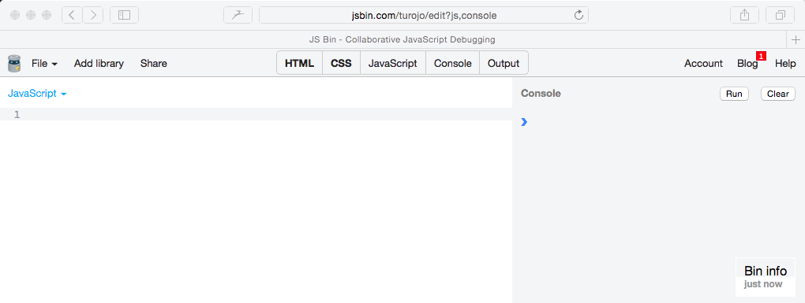

This code calls the phone number `555-555-5555` and say the message
`Gossip Girl here, your one and only.` We don't want that.

Change `555-555-5555` to your own phone number. Feel free to change the
message too.

> 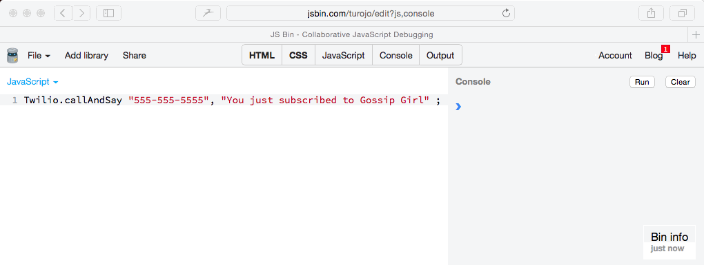

Go ahead and press the "Run" button.

> 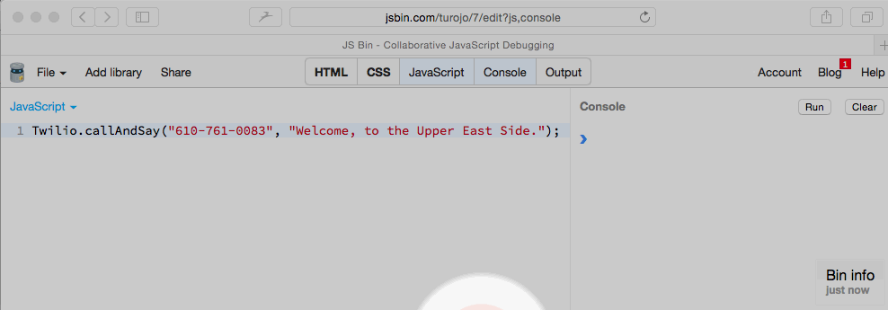

Your phone should ring shortly! Answer it!

```
If it doesn't work, ask a neighboring group to see if they can see what's wrong.
Otherwise, raise your hand to ask a TA for help! We <3 questions!
```

Now duplicate the code to call more people's phones! Ask your neighbors for
their phone number!

> 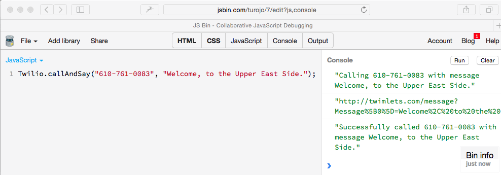

Go ahead and click run!

> 

```
Important Note

There is a lot of magic happening behind the scenes to make this
work. The magic is sitting inside the HTML file tab. We can just ignore it
for now.
```

## Outline for the rest of this tutorial

### Part I

This first section is linear and more guided.

In this section, you will learn to build an HTML5 app that, when you wave your
phone around like a magic wand, everyone's phone will ring.

<!-- TODO: Link Demo-->

Here is an outline of what you'll learn on the way:

1. [Send text messages and make phone calls with one line of code](#send-text-messages-and-make-phone-calls)
2. [Creating an account on JS Bin](#saving-our-work)
3. [Call a phone when a button is clicked](#call-a-phone-when-a-button-is-clicked)

If you're more advanced, feel free to skip this section and go to the next.
Do make sure that you [create a JS Bin account](#saving-our-work) first though.

### Part II

This section is less guided. It showcases snippets of various APIs and how to
use them.

With you partner, look around to see what snippets you think are cool.
Pick and choose some of them to build a mini project!

We can break the tools into two categories:

**Actions**

Actions are just actions:

- send a text message (addressed above)
- call a phone and have a computer voice say something (addressed above)
- call a phone and play music
- play music through the web page

**Triggers**

Triggers run any code you want WHEN something happens. For example, you can
run code:

- When a button is pressed
- When the phone is "waved" like a magic wand
- When you receive a text message

**Part III**

This section tries to explain how the hell this all works--well, at least
what you need to know to reproduce these results somewhere else.

## Part I

### Send text messages and make phone calls

We've already learned how to make a phone call and say something in the
[Quick Demo](#quick-demo).

Let's learn how to send text messages and call phones that play music.


#### Sending Text Messages

Type the below code as it is written _exactly_ in the JS Bin:

```js
Twilio.sendMessage("555-555-5555", "Evening upper east siders...");
```

First change `555-555-5555` to your own phone number. Feel free to change the
message too.

> 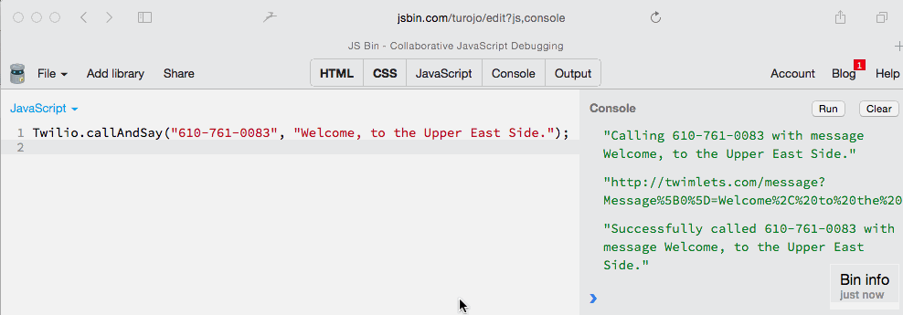

Go ahead and click "Run" again.

> 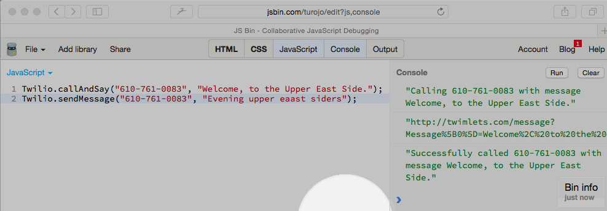

Because I left the code that calls my phone, I get a phone call as well
as a text message.

> If it doesn't, ask a neighboring group to see if they can see what's wrong.
> Otherwise, raise your hand to ask a TA for help!

> 

### Saving Our Work

Huzzah! We did it! We're done! Now we need to save our work!

To do that, we must create a JS Bin account first.

```
IMPORTANT NOTE

Make sure that BOTH you and your partner, do the below steps individually.
After signing up for all the accounts, then you can pair again.
```

#### Creating a JS Bin Account

When we click "Login or Register"

> 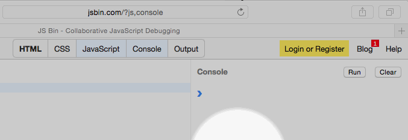

We see that we can "Login or Register via GitHub".

Think about this like Facebook Login, except it is GitHub login.

What is GitHub?

It is a website used by many professional coders to collaborate on code.
Think Dropbox, but for code.

Let's make a GitHub account!

#### Creating a GitHub account

Let's create our own GitHub account.

##### In a new window, open [`https://github.com`](https://github.com)

> 

##### Create an account with a valid email

> 

##### Click "Sign up for GitHub"

> 

##### Validating your Email Address

- Check your email inbox for a confirmation email from GitHub
- Make sure you click on the link it tells you to to confirm your account.

> *Important Note*: If you don't do this now, you may run into an error in the
> the future that may get you to rip your hair out!

#### Login with GitHub

Now that you have a GitHub account, you can login with GitHub

> 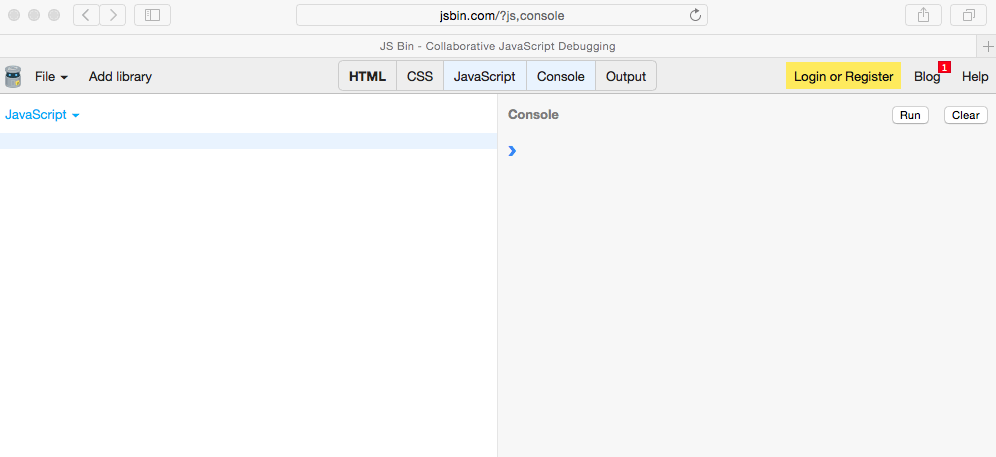

Great! We now have our own JS Bin and GitHub accounts!

**Next**

We learned how to call a phone and send a text message.
Now let's make this work when I press a real button on a website!

### Call a phone when a button is clicked

#### Trying it

Go ahead and open up [this new JS Bin](http://jsbin.com/fawuda/33/edit?html,js,console,output).

There are 4 panels now:

> 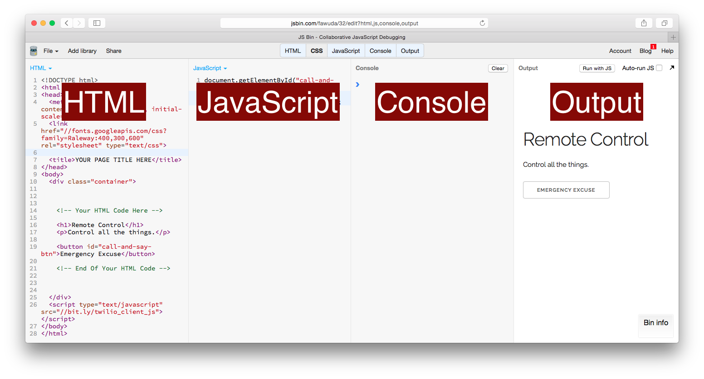

To show or hide a tab, just click the tab:

> 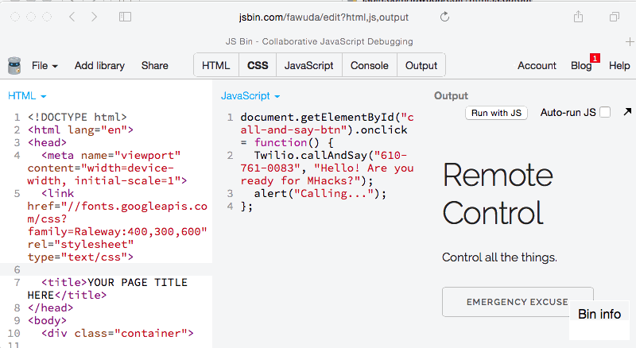

Before you do anything, in the JavaScript tab, change the `555-555-5555` phone number to your number.

> 

Then click the checkbox for "Auto-run JS"

> 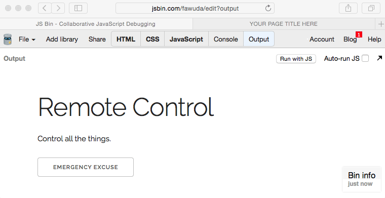

When you click the button that says "Emergency Excuse", it will call your phone
and say "Hello! Are you ready for MHacks?" (Ths feature might come in handy when
you are on an awkward date and you need your phone to ring...)

Go ahead and click the "Emergency Excuse" button:

> 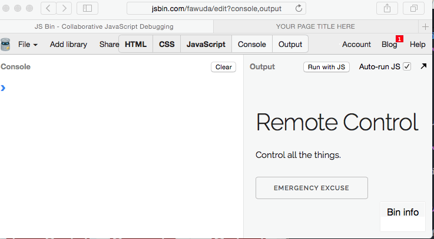

> If it doesn't, ask a neighboring group to see if they can see what's wrong.
> Otherwise, raise your hand to ask a TA for help!

#### Trying to understand the code.

There are two pieces of code that make this work, the code in the HTML:

```html
<button id="emergency-button">Emergency Excuse</button>
```

located here:

> 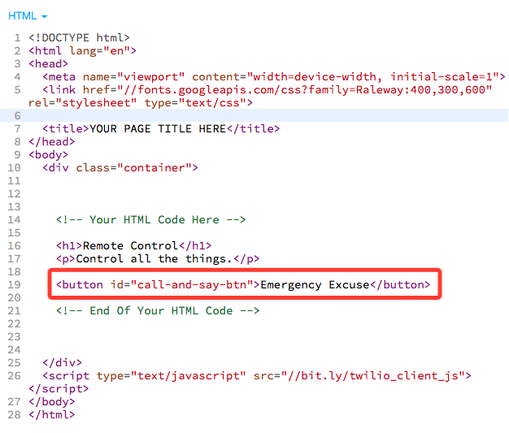

And the code in the JavaScript:

```js
document.getElementById("emergency-button").onclick = function() {
  Twilio.callAndSay("555-555-5555", "This is your boss! Get over here!");
  alert("Calling...");
};
```

With your parter (and maybe some neighbors), spend just 1-2 minutes trying to
talk through how you think this code works. (Hint: say the JavaScript out loud
**slowly**...)

#### Understanding the code

Instead of explaining how the existing code works, I will explain by going
through the process of adding another button. When I press this new button, it
will call me and say "Time to wake up! Keep hacking! Just do it!".

##### Adding the button

In the HTML let's add another button by writing:

```html
<button>Motivate Partner</button>
```

> 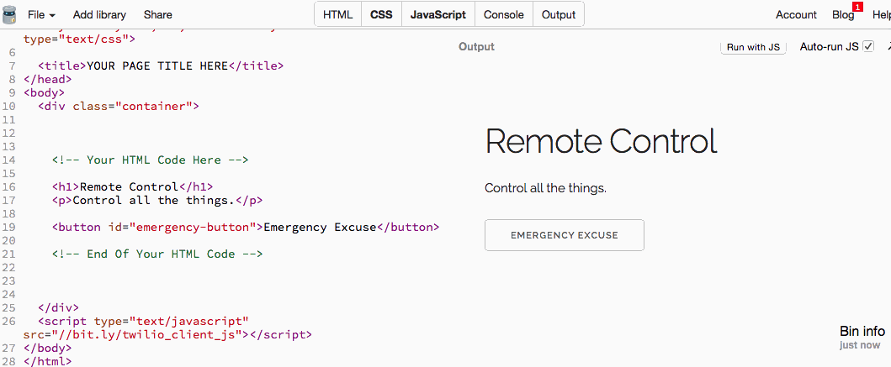

<!--Result-->

##### Adding an id to the button

Then we need to give this button some id so we can refer to it by its id in the
JavaScript.

```html
<button id="motivation-button">Motivate Partner</button>
```

> 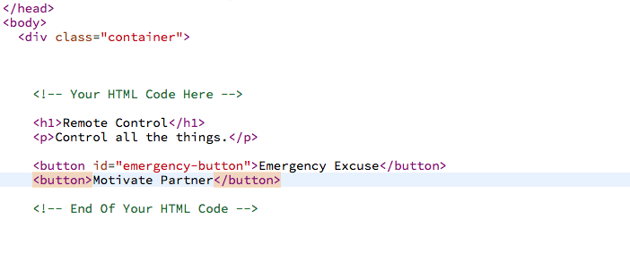

##### Referencing the button from JavaScript

Now that we set the button's id, we add this to our JavaScript:

```js
document.getElementById("motivation-button").onclick = function() {
    [PUT ANY CODE HERE YOU WANT WHEN THE BUTTON IS CLICKED]
};
```
_Don't include the `[PUT ANY CODE HERE YOU WANT WHEN THE BUTTON IS CLICKED]`_

> 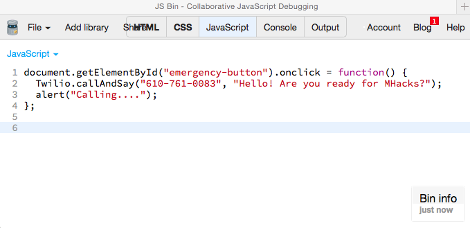

There is a lot to understand in the above code but if you read it out loud like
this, it might begin to make sense:

_Note that I highlighted the keywords from the code_

In the `document`, `get` the `element` with the `id` `"motivation-button"` and
when it is `clicked`, run any of the code that is inside the `function`.

There are definitely more concepts and complexities here but we won't worry
about them in this workshop. If you want to read more about what's happening
here, feel free to Google `javascript function` and `document.getElementById`
and/or ask a TA!

##### Adding an alert

Now we can add the code inside of the `function`.

Let's add what's called an `alert` to the JavaScript

`alert("You pressed the button");`

> 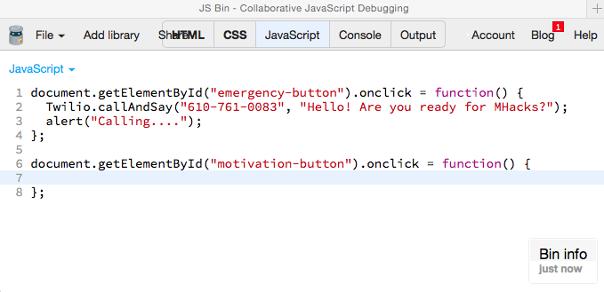

Now when you click the button, it should create a pop-up, but JS Bin blocks
them in this view. You'll need to click the black arrow to pop the output out:

> 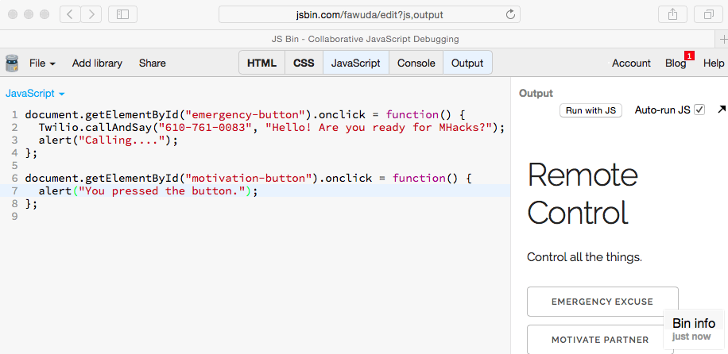

Now click the `Motivate Partner`

> 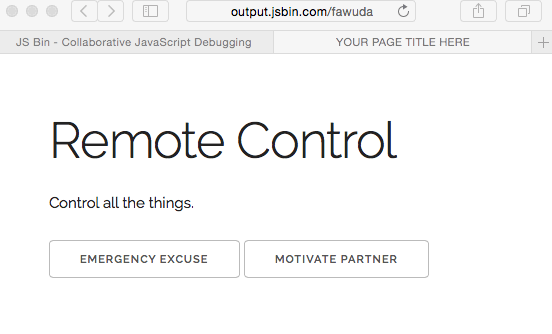

> If it doesn't, ask a neighboring group to see if they can see what's wrong.
> Otherwise, raise your hand to ask a TA for help!

##### Adding the actual code to make the phone call:

Let's add the actual code to make the phone call back in.

Don't forget to change the `555-555-5555` phone number to your own.

```js
document.getElementById("dead-people-btn").onclick = function() {
  Twilio.callAndSay("555-555-5555", "I see dead people. I see dead people");
  alert("You pressed the button.");
};
```

If you try pressing the `I see dead people` button, you should get a phone call!

> If it doesn't, ask a neighboring group to see if they can see what's wrong.
> Otherwise, raise your hand to ask a TA for help!

##### Calling all of the people

```js
document.getElementById("dead-people-btn").onclick = function() {
  Twilio.callAndSay("555-555-5555", "Time to wake up! Keep hacking! Just do it!");
  alert("Calling...");
};
```
> 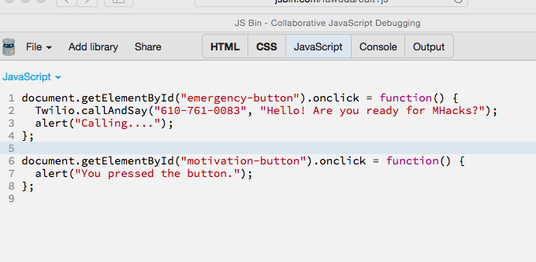

#### Trying it out on mobile

This website is responsive so let's open it on your phone.

Just click "Share" and then "Output only" to get the URL

> 

Then type in the URL into your mobile browser. (You can also be clever and
write a line of code to send the URL to your phone with a text message).

### The final code

Here's what [my code looks like](http://jsbin.com/fawuda/35/edit?html,css,js,console,output) right now.

## Part II

### Actions

#### Call And Play Music Through Phone

```js
Twilio.callAndPlay("555-555-5555", "http://a.tumblr.com/tumblr_lie8ewfdbO1qzbwpvo1.mp3");
```

[JS Bin](http://jsbin.com/fawuda/36/edit?js,console)

(don't forget to change the phone number and click the "run" button)

#### Play Music Through Your Computer

```js
var audio = new Audio("http://a.tumblr.com/tumblr_lie8ewfdbO1qzbwpvo1.mp3");
audio.play();
```

[JS Bin](http://jsbin.com/fawuda/37/edit?js,console)

(don't forget to change the phone number and click the "run" button)

```
Random note: if you're trying to play a sound on mobile, it must be activated
with a button press first before it can play.
```

### Triggers

#### Magic Wand

When the mobile phone is waved like a magic wand, have it trigger something

First include this javascript library at the bottom of the page:

```html
<script type="text/javascript" src="//bit.ly/wand_js"></script>
```

> 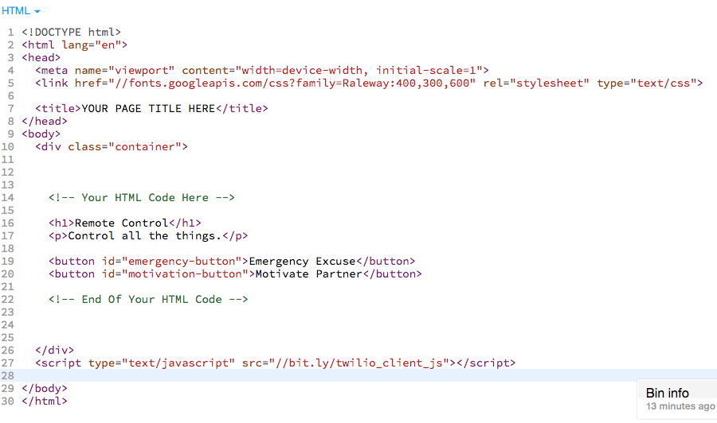

Then add this code in the JavaScript

```js
Wand.threshold = 5;
Wand.onWave = function() {
  alert("Wand Waved")
  // INSERT CODE HERE YOU WANT TO RUN WHEN YOU HAVE THE WAND
}
```

> 

Adjust

```js
Wand.threshold = 5;
```

The larger the number, the harder you have to fling the wand in order for it to
trigger.

For an iPhone 6, I personally like
```js
Wand.threshold = 20;
```


#### When you receive a text message

```js
Twilio.listenForMessages(function(data) {
  alert("I received an SMS from " + data.from);
  alert("They said " + data.body);
});
```

These are all the properties that you can receive:

```json
{
    "toCountry": "US",
    "toState": "PA",
    "smsMessageSid": "SMe182077e5d6045773c289815dcca25fd",
    "numMedia": "0",
    "toCity": "NORRISTOWN",
    "fromZip": "19486",
    "smsSid": "SMe182077e5d6045773c289815dcca25fd",
    "fromState": "PA",
    "smsStatus": "received",
    "fromCity": "NORRISTOWN",
    "body": "Yo",
    "fromCountry": "US",
    "to": "14846854323",
    "toZip": "19406",
    "numSegments": "1",
    "messageSid": "SMe182077e5d6045773c289815dcca25fd",
    "accountSid": "AC0a9665bd93b240f6ad384761b3e3b47c",
    "from": "16107610083",
    "apiVersion": "2010-04-01"
}
```

And then you can do cool stuff like:

```js
Twilio.listenForMessages(function(data) {
  Twilio.sendMessage(data.from, "You said '" + data.body + "'");
});
```

You can start to do more advanced logic like implementing a chat bot.
